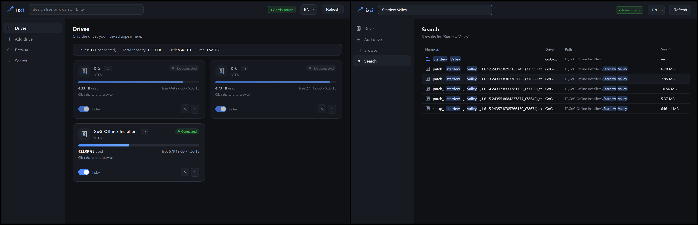

# İzci



A desktop app that indexes the contents of your external drives so you can browse
and search them while drives are offline.

Built with Electron, Vite and SQLite.

---

## Features

- **Offline access.** Index a drive once; its file tree stays in a local database,
  so you can browse and search it later with the drive detached.
- **Opt-in indexing.** Nothing is indexed by default. Plugged-in drives appear in
  *Add drive*, where you tick the ones you want. Your system drive (C:) stays out
  of the way unless you explicitly add it.
- **Tracked by hardware, not by letter.** A drive is identified by its physical
  disk serial number, so unplugging and replugging it under a different letter
  (F: → G:) does not create a duplicate or lose the index.
- **Fast full-text search.** SQLite FTS5 with prefix matching, highlighted hits,
  and folders listed before files.
- **Folder browsing** with a breadcrumb, working offline.
- **Custom labels** for each drive, stored only inside the app.

## Requirements

- **Windows** — drive detection uses PowerShell.
- **Node.js ≥ 22.5.0** to run from source (uses the built-in `node:sqlite`).

## Quick start

```
npm install
npm run build
npm start
```

## Documentation

- **[USAGE.md](USAGE.md)** — full usage guide: every screen, setting, indexing,
  searching, sorting, labels, data location, building an executable and
  troubleshooting.

## License

Not yet specified.
